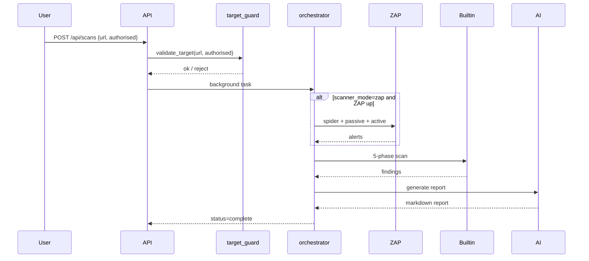
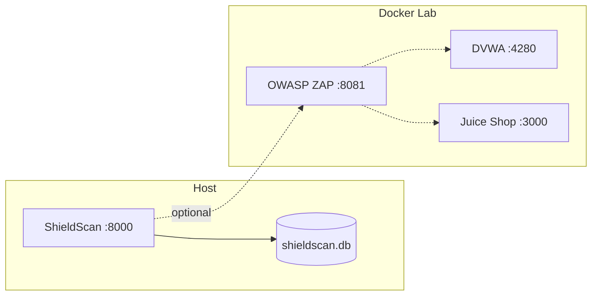

# Architecture: ShieldScan

**Version:** 1.0  
**Last updated:** 2026-06-29

## 1. System Overview

ShieldScan is a FastAPI application with a static web dashboard, SQLite persistence, and a pluggable scan orchestrator that combines OWASP ZAP DAST with a 5-phase built-in scanner.

```mermaid
graph TB
    UI[static/index.html] --> API[FastAPI app/main.py]
    API --> Router[routers/scans.py]
    API --> Health[/health /ready]
    Router --> Orch[scan_orchestrator.py]
    Orch --> ZAP[zap_client.py]
    Orch --> Builtin[builtin_scanner.py]
    Orch --> AI[ai_reporter.py]
    Builtin --> Crawl[crawler.py]
    Builtin --> OWASP[owasp_top10.py]
    Builtin --> Ext[extended_checks.py]
    Builtin --> Deep[deep_probes.py]
    Router --> DB[(SQLite)]
```

**Ecosystem position:** RytScan (BreachDirect) covers Soroban contract static analysis; ShieldScan covers the web/API attack surface for the same Wave contributors.

## 2. Repository Layout

| Path | Role |
|---|---|
| `app/main.py` | FastAPI entry, static mount, health/readiness |
| `app/errors.py` | Standardised API error envelope |
| `app/routers/scans.py` | Scan CRUD, progress, report export |
| `app/services/scan_orchestrator.py` | Scan state machine, dedupe, AI report |
| `app/services/builtin_scanner.py` | 5-phase built-in engine coordinator |
| `app/services/zap_client.py` | OWASP ZAP REST API client |
| `app/services/secrets.py` | Startup secrets validation |
| `app/services/target_guard.py` | Authorisation + target safety checks |
| `static/` | Dashboard (HTML/CSS/JS) |
| `tests/` | Pytest contract + health tests |
| `docs/` | PRD, architecture |
| `docker-compose.yml` | ZAP, DVWA, Juice Shop lab |

## 3. Scan Pipeline



### 3.1 Built-in Scanner Phases

| Phase | Module | Checks |
|---|---|---|
| 1 — Crawl | `crawler.py` | Up to 80 pages, depth 4, robots/sitemap |
| 2 — Passive | `passive_checks.py` | Headers, TLS, cookies |
| 3 — OWASP Top 10 | `owasp_top10.py` | XSS, SQLi, CMDi, IDOR, CSRF, auth |
| 4 — Extended | `extended_checks.py` | CORS, sensitive paths, directory listing |
| 5 — Deep probes | `deep_probes.py` | LFI, SSTI, NoSQL, API fuzz, rate limits |

### 3.2 Scanner Modes

| Mode | Behaviour |
|---|---|
| `zap` | ZAP full scan + built-in (when ZAP container reachable) |
| `builtin` | Built-in only — no Docker required |

## 4. API Design

### 4.1 Endpoints

| Method | Path | Description |
|---|---|---|
| GET | `/` | Dashboard |
| GET | `/health` | Liveness + scanner metadata |
| GET | `/ready` | Readiness (DB ping) |
| POST | `/api/scans` | Start scan (requires `authorised: true`) |
| GET | `/api/scans` | List recent scans |
| GET | `/api/scans/{id}` | Scan detail + findings |
| GET | `/api/scans/{id}/progress` | Live progress |
| GET | `/api/scans/{id}/report/html` | HTML report |
| GET | `/api/scans/{id}/report/download` | Markdown download |

### 4.2 Error Envelope (Wave #159 contract)

All API errors return a stable JSON shape:

```json
{
  "error": {
    "code": "VALIDATION_ERROR",
    "message": "Human-readable summary",
    "details": {}
  }
}
```

| Code | HTTP | When |
|---|---|---|
| `VALIDATION_ERROR` | 422 | Pydantic / request validation |
| `AUTHORISATION_REQUIRED` | 400 | `authorised` not confirmed |
| `TARGET_NOT_ALLOWED` | 400 | Blocked target (safety guard) |
| `NOT_FOUND` | 404 | Scan or report missing |
| `INTERNAL_ERROR` | 500 | Unhandled server error |

## 5. Operational Endpoints (Wave #1034)

### `/health` — Liveness

Returns service identity, scanner version, and capability list. Used by process supervisors.

### `/ready` — Readiness

Executes `SELECT 1` against SQLite. Returns `503` if database unavailable. Used by deploy gates and `make ci` smoke checks.

## 6. Security Architecture

### 6.1 Secrets (Wave #29 pattern)

- API keys loaded from `.env` via `pydantic-settings`
- `secrets.validate_settings()` warns on default `ZAP_API_KEY=changeme` in non-dev
- `.env` excluded from git; `.env.example` documents placeholders

### 6.2 Target Guard (Wave #231 pattern)

- `authorised: true` required on every scan request
- Optional blocklist for RFC1918 / localhost in production mode
- Lab mode (default) allows `127.0.0.1` for DVWA/Juice Shop demos

### 6.3 CI Security Gate

```bash
make security-ci   # bandit + pip-audit
make test          # pytest contract tests
make ci            # lint + test + security-ci + smoke health
```

## 7. Data Model

```
Scan
├── id, target_url, status, status_message
├── scanner_used, risk_grade
├── finding_count, critical_count, high_count
├── findings_json (serialised Finding[])
├── ai_report, executive_summary
└── created_at, completed_at, error_message
```

## 8. Deployment Topology



## 9. Phase Roadmap (Technical)

| Phase | Focus | Key modules |
|---|---|---|
| 1 ✅ | Platform foundation | errors, health, tests, CI, docs |
| 2 | Scanner depth | owasp_top10, deep_probes, SARIF export |
| 3 | ZAP reliability | zap_client, timeout policies |
| 4 | AI + SMB UX | ai_reporter, safety score |
| 5 | Dashboard platform | static/, report branding |
| 6 | Ecosystem | RytScan bridge, GitHub Action |

---

**See also:** [prd.md](./prd.md) · [RytScan architecture](https://github.com/BreachDirect/RytScan/blob/main/docs/architecture.md)
